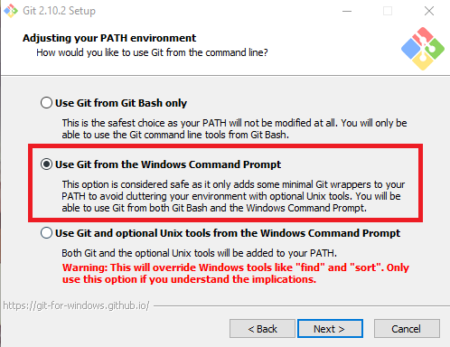
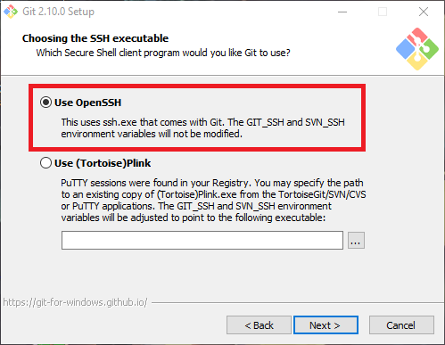
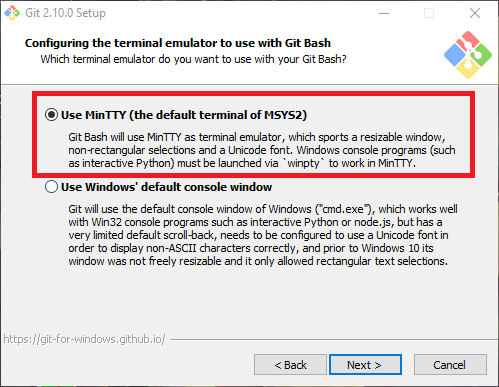
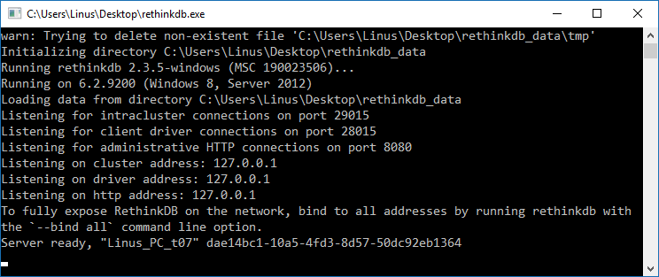
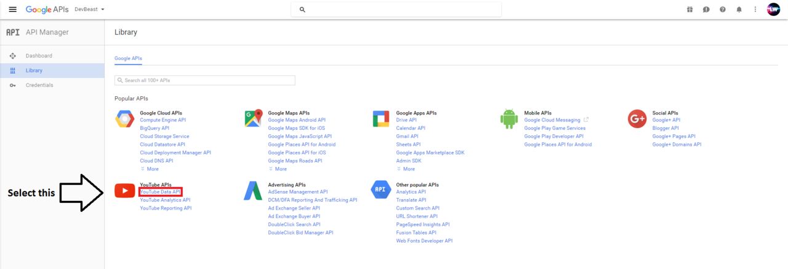
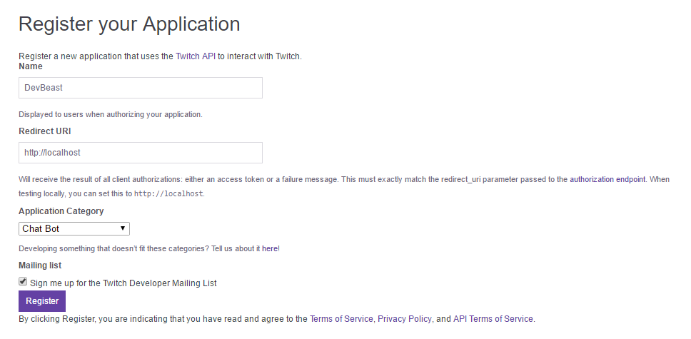
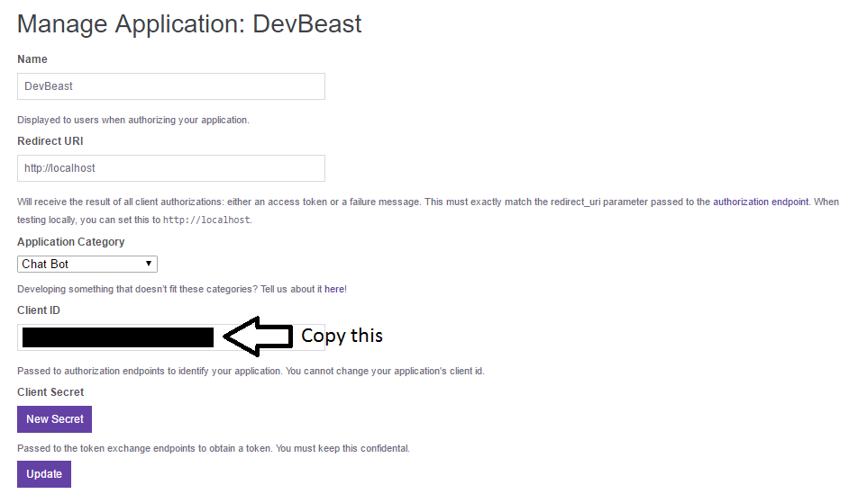
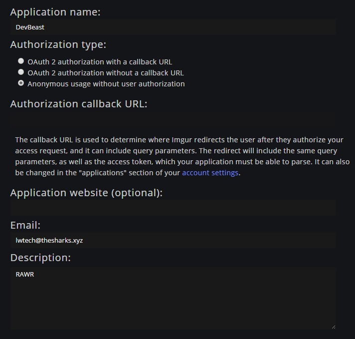
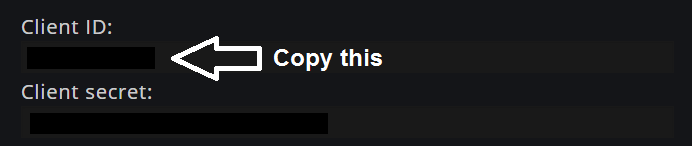
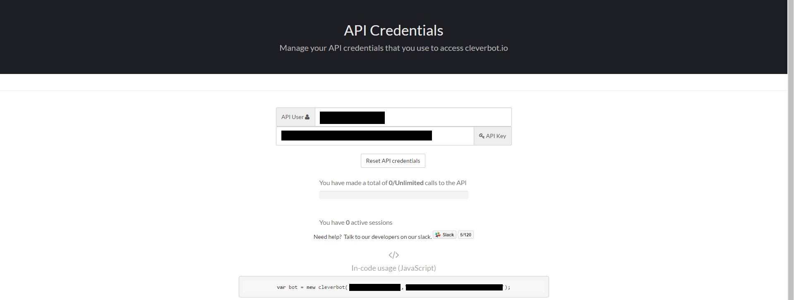

Welcome to the installation guide for WildBeast on Windows! In this guide, we'll walk you through the installation and deployment process for WildBeast on Windows.

## Prerequisites

- Windows system
	- Most Windows systems can run this bot fine, unless you have a really low-end laptop
	- OS: Windows 7 and up
	- Administrator access to the computer
- Programs
	- We will be installing programs that are directly related to the bot later on
	- These programs are required pre-setup:
		- A code editor, i.e. [Notepad++](https://notepad-plus-plus.org/) or [Atom](https://atom.io) or [Brackets](http://brackets.io/)

## Installation

!!! note
    Quite a few steps in this guide will be using administrative permissions. Therefore we recommend that you are logged into an administrator account to not have to type the admin password every time you perform something.

### Installing Node

Go to [the Node.js download page](https://nodejs.org/en/download/) and download the version relevant to your OS bit version. It's pretty straight forward, just make sure that the features tab looks like this.


When that's installed, it's time to retrieve the WB repository.

### Installing Git and retrieving WildBeast

Next we'll install Git to be able to download WildBeast. Start off by going to [the Git download page](https://git-scm.com/downloads) and download the Windows installer.

!!! danger
    The installation process of Git has to go exactly as described below, otherwise you will have to take longer ways around!

Once downloaded, run the installer. Read the license and continue. Once you get to the component selection, check that it looks like the image below.


After selecting the start menu folder, this is where things get precise. **Tick the boxes exactly as follows!**








In text:

`Use Git from the Windows Command Prompt`  
`Checkout Windows-style, commit Unix-style endings`  
`Use OpenSSH`  
`Use MinTTY (the default terminal MSYS2)`  

If you followed through correctly, you've got Git set up in a way that allows you to perform setup and future maintenance without hitches.

Now, you'd want to figure out where you want the bot to be downloaded. Something simple where you can find it is good, AKA not in the system internals (Possibly some other drive, though **NOT A FLASH DRIVE**) or optionally your Desktop could be fine. When you've found the location of your choice, Shift+Right Click in that particular location and select "Open command window here". Then clone the WildBeast Git repository with `#!bash git clone https://github.com/TheSharks/WildBeast && cd WildBeast`.

!!! tip "Why to download with Git"
    We're instructing you to use Git for downloading WildBeast to make future updating processes easier. If you were to download the ZIP package, you'd need to redownload it every time you want to update. For more info, see [Updating](updating.md).

Let the clone process complete. When it's done, you've downloaded WildBeast successfully.

### Installing Python 2.7.12

From WildBeast version 4.0.0 onwards, the `fibers` package is used in the bot. This package requires Python 2.7 to install, and hence we will also install that.

[Click here](https://www.python.org/ftp/python/2.7.12/python-2.7.12.msi) to directly download the Python 2.7 installer. (Official source from python.org)

Open the installer. Other options don't matter that much, but these two screens are crucial to have **exactly as follows!**


It is particularly important that you have all the boxes described in the latter image ticked in order for Python 2.7 to work properly. Once you have completed this, proceed to the next step.

!!! note "Note to users with existing Python 3.5 installations"
    The PATH variable `python` will be duplicated in this process. To distinguish what refers to which Python version you can browse to either Python installation directory (2.7 or 3.5) and rename `python.exe` to for instance `python2` or `python3` and so forth.

### Installing the Node dependencies

Now it's time to install the Node dependencies for the bot. Open a command prompt in the WildBeast folder (Shift+Right click) and select "Open command window here". Run `npm install` and wait for the process to complete.

!!! warning "Issues with npm install"
    If you get errors that say `WARN` and use  yellow text, you can ignore them. If you however start getting red text, there might be a problem installing.
    
    Check that the WildBeast directory does not require administrator permissions to execute commands in. You may come and ask us [over at WildBot's Territory](https://discord.gg/wildbot) if you need help fixing these errors.

#### Node-gyp and npm install

The `fibers` package requires node-gyp to build. Node-gyp may fail on building of `fibers` if a GCC compiler isn't installed on the system. If you get an error that resembles to the one below, you are having this issue.

```bash
gyp ERR! build error

gyp ERR! stack Error: C:\Windows\Microsoft.NET\Framework\v4.0.30319\msbuild.exe failed with exit code: 1

gyp ERR! stack     at ChildProcess.onExit (C:\Program Files\nodejs\node_modules\npm\node_modules\node-gyp\lib\build.js:276:23)

gyp ERR! stack     at emitTwo (events.js:106:13)

gyp ERR! stack     at ChildProcess.emit (events.js:194:7)

gyp ERR! stack     at Process.ChildProcess._handle.onexit (internal/child_process.js:215:12)

gyp ERR! System Windows_NT 10.0.14393

gyp ERR! command "C:\Program Files\nodejs\node.exe" "C:\Program Files\nodejs\node_modules\npm\node_modules\node-gyp\bin\node-gyp.js" "rebuild" "--release"

gyp ERR! cwd %WildBeastDirectory%\node_modules\fibers

gyp ERR! node -v %NodeVersion%

gyp ERR! node-gyp -v %Node-gypVersion%

gyp ERR! not ok
```

To fix this, open an administrative command prompt (Start Menu -> Type 'cmd' -> Right click and Run as administrator) and run `npm install --global --production windows-build-tools`. After that do `npm install` again.

### Installing RethinkDB and creating the DB

As of WildBeast version 4.0.0, the bot uses RethinkDB to store server-specific data. This includes server owner, customize options and a whole bunch of other things.

!!! warning
    Do not change RethinkDB options or execute commands outside of the ones we tell you to unless you understand RethinkDB and can fix it yourself in case you mess up.

Click [this link](https://download.rethinkdb.com/windows/rethinkdb-2.3.5.zip) to download the RethinkDB binary. (Official download, again)

When the file has downloaded, extract rethinkdb.exe to the WildBeast directory. This makes it easier to store all data in one place. In the WildBeast directory, run rethinkdb.exe. The RethinkDB server will start. When the output resembles to the one displayed below, you're good to go.

!!! warning
    Remember to leave the RethinkDb window open or the database server will shut down!



## Configuration

Find `config.example.json` on your PC and open it using Notepad++ or any other code editor.

!!! failure "What not to do"
    Don't open the file with Windows Notepad. This will cause a bucketload of issues that just complicate the install process. Use a modern text editor like [Notepad++](https://notepad-plus-plus.org/).

### The config file

When opening the config file, you should have a file that looks like the [example config](https://github.com/TheSharks/WildBeast/blob/master/config.example.json).

We'll now walk you through the different sections in the config and what they do.

#### Bot section

| Property | Explanation | Type |
| -------- | ----------- | ---- |
| token | OAuth token for the bot. | [String](https://developer.mozilla.org/en-US/docs/Web/JavaScript/Reference/Global_Objects/String) |
| oauth | The OAuth URL for the bot. | [String](https://developer.mozilla.org/en-US/docs/Web/JavaScript/Reference/Global_Objects/String) |

#### Database section

| Property | Explanation | Type |
| -------- | ----------- | ---- |
| host | Points to WildBeast's database, localhost by default. | [String](https://developer.mozilla.org/en-US/docs/Web/JavaScript/Reference/Global_Objects/String) |
| port | Specifies which network port the RethinkDB server is running on. | [Number](https://developer.mozilla.org/en-US/docs/Web/JavaScript/Reference/Global_Objects/Number) |
| password | Password to RethinkDB user. | [String](https://developer.mozilla.org/en-US/docs/Web/JavaScript/Reference/Global_Objects/String) |
| user | RethinkDB user account to use for accessing the database. | [String](https://developer.mozilla.org/en-US/docs/Web/JavaScript/Reference/Global_Objects/String) |

#### Settings section

| Property | Explanation | Type |
| -------- | ----------- | ---- |
| prefix | The command prefix the bot will use. | [String](https://developer.mozilla.org/en-US/docs/Web/JavaScript/Reference/Global_Objects/String) |
| autodeletemsg | Automatically delete music-related messages after a while. | [Boolean](https://developer.mozilla.org/en-US/docs/Web/JavaScript/Reference/Global_Objects/Boolean) |
| deleteTimeout | The amount of time after which to delete the messages. | [Number](https://developer.mozilla.org/en-US/docs/Web/JavaScript/Reference/Global_Objects/Number) |
| deleteTimeoutLong | Same as above, but for messages that have a longer timeout. | [Number](https://developer.mozilla.org/en-US/docs/Web/JavaScript/Reference/Global_Objects/Number) |
| maxvcslots | How many concurrent voice connections the bot can have until it won't join more. | [Number](https://developer.mozilla.org/en-US/docs/Web/JavaScript/Reference/Global_Objects/Number) |

#### Bezerk section  

!!! warning
    Do not modify any of these settings! They're for internal use only.

| Property | Explanation | Type |
| -------- | ----------- | ---- |
| use | Whether Bezerk shall be used or not. | [Boolean](https://developer.mozilla.org/en-US/docs/Web/JavaScript/Reference/Global_Objects/Boolean) |
| uri | Specifies the websocket address for the Bezerk server. | [String](https://developer.mozilla.org/en-US/docs/Web/JavaScript/Reference/Global_Objects/String) |

#### Elasticsearch section

!!! warning
    Do not modify any of these settings! They're for internal use only.

| Property | Explanation | Type |
| -------- | ----------- | ---- |
| use | Whether Elastic shall be used or not. | [Boolean](https://developer.mozilla.org/en-US/docs/Web/JavaScript/Reference/Global_Objects/Boolean) |
| client/host | Specifies the address for the Elastic server. | [String](https://developer.mozilla.org/en-US/docs/Web/JavaScript/Reference/Global_Objects/String) |  

#### Permissions section

| Property | Explanation | Type |
| -------- | ----------- | ---- |
| master | The highest possible access level of Infinity. Full permissions. | [Array](https://developer.mozilla.org/en-US/docs/Web/JavaScript/Reference/Global_Objects/Array)<[String](https://developer.mozilla.org/en-US/docs/Web/JavaScript/Reference/Global_Objects/String)> |
| level1, level2, level3 | Settable access levels that give users access to certain commands. | [Array](https://developer.mozilla.org/en-US/docs/Web/JavaScript/Reference/Global_Objects/Array)<[String](https://developer.mozilla.org/en-US/docs/Web/JavaScript/Reference/Global_Objects/String)> |

!!! note
    By default, when WildBeast joins a server it will set the owner's access level to 4. This is to give them control over normal users.

#### API keys section

| Property | Explanation | Type |
| -------- | ----------- | ---- |
| imgflip | Your [imgflip](https://imgflip.com) login details. | [String](https://developer.mozilla.org/en-US/docs/Web/JavaScript/Reference/Global_Objects/String) |
| google | For retrieving data from YouTube. | [String](https://developer.mozilla.org/en-US/docs/Web/JavaScript/Reference/Global_Objects/String) |
| twitchId | For retrieving status of whether a user on Twitch is streaming or not. | [String](https://developer.mozilla.org/en-US/docs/Web/JavaScript/Reference/Global_Objects/String) |
| imgur | For retrieving random memes from Imgur. | [String](https://developer.mozilla.org/en-US/docs/Web/JavaScript/Reference/Global_Objects/String) |
| cleverbot_user | Username to the cleverbot.io API, used in the cleverbot command. | [String](https://developer.mozilla.org/en-US/docs/Web/JavaScript/Reference/Global_Objects/String) |
| cleverbot_key | Key to the cleverbot.io API, used in the cleverbot command. | [String](https://developer.mozilla.org/en-US/docs/Web/JavaScript/Reference/Global_Objects/String) |

### Making the config

- OAuth app
	- We'll start off by creating an OAuth application in Discord's developer interface so that the bot can login.
		1. Go to [the Discord Developer dashboard](https://discordapp.com/developers/applications/me) and create a new application.
		2. Name it whatever you prefer and give it a fancy picture. Fill in a description if you want to, then click "Create application".
		3. Now you'll have a more full-fledged app page. Click "Add Bot User" and confirm to make it a bot.
		4. Here you'll get a Client ID and a token. Reveal the token (**Not the secret**) and replace "Bot token" with that in the config.
	- Next we'll make an OAuth URL for the bot so it can be added to the server.
		1. Just put this placeholder URL somewhere for now, **don't open it as it will not work**.
		`https://discordapp.com/oauth2/authorize?&client_id=CLIENTID&scope=bot&permissions=536345655`
		2. Go back to the app page, and copy the Client ID.
		3. Replace the `CLIENTID` placeholder in the URL above with the ID you just copied. You can open the URL to test that you did it right.
		4. If the URL works as intended, copy it and replace "Bot OAuth URL (...)" in the config with the one you copied.
		5. You can also open the URL and add your bot to the server at this point, so you don't forget it. It will have the permissions it wants precalculated due to the number after the `permissions` property. Just select your server from the dropdown list and add it. The bot won't do anything at this stage because we're not finished yet.
		6. If you can't select your server, it might be that you lack Manage Server permissions.
- Prefix and other settings
	- Setting the command prefix isn't really rocket science. This can be any special character, for instance `%`, `&` and so forth.
	- You can also use multiple characters as a prefix, for instance `!!` and `//`. Avoid common single-character prefixes like `!` and `/` to avoid initial prefix conflicts. These can however be resolved with `customize` and changing the prefix for the server.
	- Note that there is always a so-called global prefix: A mention. Saying `@BotName` in chat will function as a prefix as well. **This needn't be specified in the config as it's always active.**
- The rest of the options are straightforward. `autodeletemsg` can be true or false, the message deletion times can be whatever you fancy in milliseconds and `maxvcslots` is just a number.
- Permissions
	- This is a section that has a very interesting gimmick to it.
		- WildBeast has a command named `setlevel` which will set the level of a user. **However**, that is written into a server-specific config. Which means that if you set the level of someone to 2 in Server1, they will not be level 2 in Server2, for example.
		- The permissions fields here are so-called **global permissions**, and will apply unless a server-specific level is set.
		- Use this to add technicians and others who need permissions regardless of where the bot is.
    - You can specify users here by adding their IDs into the fields. Only the master field is mandatory.
    	- You can get the ID of a user by either "backlash mentioning" them, which means to say typing `\@User` in chat or by enabling Developer Mode (Personal Settings -> Appearance -> Enable Developer Mode) and right-clicking on someone, subsequently selecting Copy ID from the list and pasting it in between the quotes.
    	- Remember to follow the example syntax in the master field when adding multiple users!
- API keys
	- General notice: Anything within these fields is sensitive and could do much harm if revealed to the public. **Therefore it is imperative that you keep this to yourself.** WildBeast maintainers will **NEVER** ask for your login details or API keys. Only show the options to trusted WildBeast maintainers in WildBot's Territory.
	- imgflip
		- The procedure for getting this isn't tricky. Just go to [https://imgflip.com](https://imgflip.com), create an account and input your username and password into the fields.
	- Google
		- This API is used to retrieve data from YouTube, related to music playback.
			1. Go to [https://console.developers.google.com](the Google Developer Console) and create a new project. Name it whatever you fancy. Nothing else needs to be changed unless you want to change the project ID or the app engine location.
			2. Wait a while as the project is being created.
			3. When the creation process is completed, you'll get taken to the Dashboard screen of the project. In the sidebar on the left, click "Library".
			4. This will take you to the API library. Select "YouTube Data API" as highlighted below.
			
			5. When the API page opens, click the "Enable" button in the top bar. Then you will get a notification saying that you need to create credentials. That's exactly what we will do.
			6. Click the "Go to credentials" button. In the next dropdowns, make them look like following.
			
			7. Hit "What credentials do I need?" and the page will generate a Google API key for you. Copy the API key and replace the "A google key" placeholder with that key in the config.
	- Twitch
		- This API is used with the `twitch` command. This will be the client ID the bot passes to Twitch when retrieving stream status.
			1. Go to the [Twitch Connections page](https://www.twitch.tv/settings/connections), scroll down to the bottom and click "Register new application".
			2. Fill in the fields. Name should be your app name, and set the Redirect URI to `http://localhost` unless you want something to function differently. Set the app type to "Chat Bot" as that's what you're basically doing here.
			
			3. Click "Register". This will take you to the application management page. Down towards the bottom, there will be a section saying "Client ID".
			
			4. Copy that character sequence and replace the "A twitch Client-ID" placeholder in the config with that ID.
	- Imgur
		- This API is used in conjuction with the `randommeme` command to pull random memes from Imgur.
			1. Go to the [Imgur App Registration](https://api.imgur.com/oauth2/addclient).
			2. Fill in the application name you prefer to use. Set Authorization type to "Anonymous usage without user authentication" as no further auth will be needed for pulling memes.
			3. Fill in the email you fancy to receive notifications about this app in.
			4. Description... Well, anything you find useful there.
			5. You should end up with the below view.
			
			6. Solve the CAPTCHA and hit "Submit" on the bottom of the page. This will take you to the page where you can see your client ID and secret.
			
			7. Copy the Client ID and replace the "A Imgur Client-ID" placeholder with that value.
	- Cleverbot
		- This API is used in conjunction with the `cleverbot` command to do cleverbot discussions.
			1. Go to [cleverbot.io](https://cleverbot.io/keys) and login to get your API user and key.
			2. After logging in, copy the contents of the "API User" and "API Key" fields and paste them into the appropriate fields in the config, API User to cleverbot_user and API Key to cleverbot_key.
			

That's all, your config should now be ready to rock! Save it as `config.json`.

!!! warning
    Don't save the file as `config.example.json` as the bot will error if you do. Don't hit Ctrl+S, hit Ctrl+Alt+S!

## Running the bot

Congratulations, your WildBeast instance should be ready to launch!

WildBeast has a system built in to create the required databases and tables for you without extra effort. To do this, run `npm run-script dbcreate` in the WildBeast directory.

When this has finished, it will tell you if the necessary database and tables have been created or already existed. To test if you've done everything correctly, you can do a "test run" with the bot. This means not making it permanently available, just testing if any errors are spat out when running.

Run `node DougBot.js` in the bot's root directory to start it. If the bot runs without any errors, you have had success so far!

You can test simple functionality by running the `ping` command (With your desired prefix) in a text channel that the bot can see. If it answers "Pong!", then congratulations, **you have successfully set up WildBeast!**

**And that's it! You are now ready to start using your very own WildBeast instance!**

Keep in mind, if you have further questions or need help, we're around over at our official server! Link below.

On the behalf of the WildBeast team, **we hope you enjoy your bot!**

<p align="left">
  <a href="https://discord.gg/wildbot"></a>
</p>
