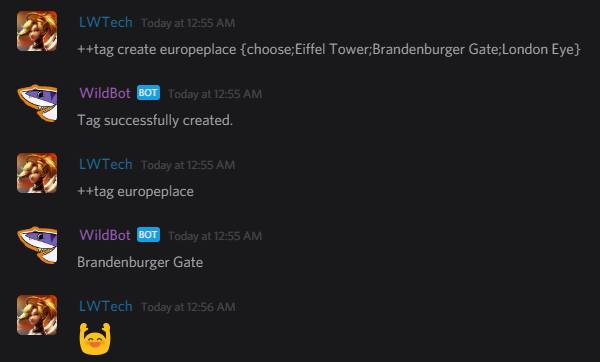

Since version 4.0.0 WildBeast has been using [TagScript](https://github.com/devsnek/TagScript) in conjunction with the `tag` command. This document will give you a brief rundown of how to use TagScript (From now on referred to as TS) to add some spice to your otherwise run-of-the-mill tags.

## Intro

### Base format

The base format for TS elements is `{datapoint;expression}` where `datapoint` is one of the below, and `expression` is the expression passed to the datapoint for parsing. Multi-parameter expressions are delimited by semicolons (`{datapoint;exp1;exp2;exp3}`).

### Datapoints

| Datapoint | Info | Example |
| --------- | ---- | ------- |
| [math](https://github.com/devsnek/TagScript/blob/master/src/builtin.js#L9) | Parse a mathematical expression. | `{math;3*3}` |
| [choose](https://github.com/devsnek/TagScript/blob/master/src/builtin.js#L10) | Randomly choose one of the options passed. | `{choose;yes;no;maybe}` |
| [range](https://github.com/devsnek/TagScript/blob/master/src/builtin.js#L11) | Randomly pick a number in a range between `min` and `max`. | `{range;1;10}` |
| [randstr](https://github.com/devsnek/TagScript/blob/master/src/builtin.js#L12-L16) | Generate a random string using the passed characters and length. | `{randstr;AaBb1234;10` |
| [lower](https://github.com/devsnek/TagScript/blob/master/src/builtin.js#L17) | Convert the passed string to lowercase. | `{lower;THIS}` |
| [upper](https://github.com/devsnek/TagScript/blob/master/src/builtin.js#L18) | Convert the passed string to uppercase. | `{upper;this}` |
| [length](https://github.com/devsnek/TagScript/blob/master/src/builtin.js#L19) | Return the length of the passed expression. | `{length;owowhatsthis}` |

!!! note
    WildBeast only uses internal TS datapoints as of the time of writing. Custom datapoints may be added in the future, this document will be updated accordingly if that becomes apparent.

!!! warning "Datapoints missing?"
    Not all datapoints are described here. This is due to them being irrelevant to the command entirely or not being usable for you.

## Integrating TagScript into tags

You can pass TS expressions to `tag create` or `tag edit` and they will evaluate & return values automatically when the tag is called with `tag`. Given that you formatted it correctly, that is.

Practical example: I want WildBot to choose a place for me to visit in Europe. I create the following tag:

```
++tag create europeplace {choose;Eiffel Tower;Brandenburger Gate;London Eye}
```

When I call the tag with `++tag europeplace`, it will give me one of the options I passed.



In this case, it chose the Brandenburger Gate!

## Conclusion

And that, in a nutshell, is how you can use TagScript to make your tags a little more dynamic. Have fun tinkering with it!
